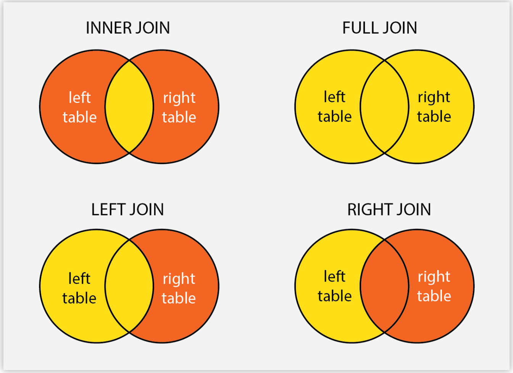

```{r setup, include=FALSE}
PKGS <- c("learnr", "stringr", "tidyverse", "tidyr", "dplyr", "tibble", "ggplot2", "nycflights13", "lubridate")

for(p in PKGS){
    if(!require(p, character.only=TRUE)){
        install.packages(p)
        stopifnot(require(p, character.only=TRUE))
    }
}

library(learnr)
library(stringr)
library(tidyverse)
library(tidyr)
library(dplyr)
library(tibble)
library(ggplot2)
library(nycflights13)
```

## Goals

This week, we have two goals: 

- Further exploring the `ggplot2` plotting library
  - Customization of labels and scales
  - Facet plots
  - Additional geoms
    - Histograms, Density Plots
    - Box and Violin plots
    - Smoothers
    - "Hexbin" Plots
  - Themeing
  - The wide world of ggplot extensions
- Diving deeper into Tidy Data Manipulation
  - More `dplyr`
    - Joins

We'll actually begin with `dplyr` joins since we already discussed SQL joins. 
But before we do, a quick review quiz on Markdown syntax and some warm-up:

## Quiz - Markdown syntax

```{r q_markdown, echo = FALSE}
quiz(caption = "Quiz - Markdown Syntax",
  question("What is Markdown?",
    answer("A plain text markup language originally designed for web pages", correct=TRUE),
    answer("A WYSIWYG language like MS Word"),
    answer("Another way to write R code"),
    allow_retry = TRUE, random_answer_order=TRUE
  ), 
  question("What is RMarkdown?", 
           allow_retry=TRUE, random_answer_order=TRUE,
           answer("An extension to basic markdown to add support for executing code", correct=TRUE),
           answer("Software written in R that renders Markdown documents", message="Close. RMarkdown pre-processes the document to execute embedded code but the actual rendering is done by pandoc."),
           answer("A Jupyter-like notebook format")),
  question("What types of documents can I render using (R)Markdown?", 
           allow_retry=TRUE, random_answer_order=TRUE,
           answer("All of these and more", correct=TRUE),
           answer("HTML Documents"),
           answer("PDF Documents"),
           answer("Word Documents"),
           answer("Presentations / Slide Shows", message="RMarkdown comes with a few slide templates - check them out using the RStudio new file dialog")),
  question("What is the Markdown syntax for basic emphasis: *example*?", 
           allow_retry=TRUE, random_answer_order=TRUE,
           answer("Surrounded with a star on each side -- `*example*`", correct=TRUE),
           answer("Surrounded with pound symbols on each side -- `#example#`"),
           answer("Surrounded by an explicit emphasis directive -- `..emph example..`", message = "This isn't Markdown: it's (almost) the syntax used by ReStructured Text (rst) which is similar but not as popular")),
  question("What is the Markdown syntax for _inline_ verbatim text, typically used for code?", 
           allow_retry=TRUE, random_answer_order=TRUE,
           answer("A single pair of back-ticks -- `` `3+3` ``", correct=TRUE),
           answer("A single pair of underlines -- ` _3+3_ `"),
           answer("A double pair of back-ticks -- ` ``3+3`` `")),
  question("What is the Markdown syntax for a _bullet list_?", 
           allow_retry=TRUE, random_answer_order=TRUE,
           answer("A left justified dash followed by text -- `- Some text`", correct=TRUE),
           answer("Four spaces, a dash, and then text -- `    - Some text`", message="Almost! This is actually an indented list, so you can use this syntax for a list within a list."),
           answer("A number, a period, and then text -- `1. Some text", message="This is a numbered list, not a bullet list.")),
  question("What is the Markdown syntax for a section divider?", 
           allow_retry=TRUE, random_answer_order=TRUE,
           answer("One or more (left-justified) pound symbols followed by text -- `# Example`", correct=TRUE, 
                  message="Increase the number of pound symbols for sub-sections (nested structure)"),
           answer("Surrounded with a star on each side -- `*example*`"),
           answer("Surrounded with pound symbols on each side -- `#example#`")),
  question("What is the RMarkdown syntax for a _code block_? [NB A block of code **to be executed**, not just to be printed] ", 
           allow_retry=TRUE, random_answer_order=TRUE,
           answer("Triple backticks and a ``{r}`` header", correct=TRUE),
           answer("An ``{r}`` header",),
           answer("Triple backticks"))
)
```

## Review

Before exploring new material, let's review `dplyr` and `ggplot2` on some new data sets. The file `births.csv` contains records of the number of babies born in the US (as reported to the Social Security Administration) every day for a 20 year period. 

```{r}
if(!file.exists("~/births.csv")){
    download.file("https://raw.githubusercontent.com/michaelweylandt/STA9750-2024S/main/births.csv", 
                  destfile="~/births.csv")
}
library(readr)
library(dplyr)

births <- read_csv("~/births.csv")
glimpse(births)
```

The columns here are
- `id` : The day in the entire time series (going up to $\approx 365 * 20$ plus a few for leap day)
- `day_of_year`: the day in the year (1 to 365/366)
- `day_of_week`: the day of the week, coded as an integer
- `day`, `month`, `year`: the parts of the date as we normally think of them
- `births`: the number of births that day. 

### `dplyr`

Using the `births` data, answer the following questions using the `dplyr` 
tools we covered two weeks ago: 

- `filter` -- analogous to SQL `WHERE` or `HAVING` depending on where you use it
- `group_by` -- analogous to SQL `GROUP BY`
- `summarize` -- analogous to SQL `GROUP BY` + an aggregation function (mean, sum, *etc.*)
- `` -- analogous to SQL `GROUP BY`


How many children were born on January 1st, 1984? 
```{r ex1, exercise = TRUE}
if(!file.exists("~/births.csv")){
    download.file("https://raw.githubusercontent.com/michaelweylandt/STA9750-2024S/main/births.csv", 
                  destfile="~/births.csv")
}
library(readr)
library(dplyr)
births <- read_csv("~/births.csv")
```

```{r ex1-solution}
births |> filter(day==1, month==1, year==1984)
```

How many total children were born in 1984? 

```{r ex2, exercise = TRUE}
library(readr)
library(dplyr)
births <- read_csv("~/births.csv")
```

```{r ex2-solution}
births |> filter(year==1984) |> summarize(sum(births))
```

How many children were born each year? (Print a 20 row table)

```{r ex3, exercise = TRUE}
library(readr)
library(dplyr)
births <- read_csv("~/births.csv")
```

```{r ex3-solution}
births |> group_by(year) |> summarize(n_births = sum(births))
```

How many more children were born each year than the preceeding? (The `lag` function will be useful here!)

```{r ex4, exercise = TRUE}
library(readr)
library(dplyr)
births <- read_csv("~/births.csv")
```

```{r ex4-solution}
births |> 
    group_by(year) |>
    summarize(n_births = sum(births)) |>
    mutate(increase_births = n_births - lag(n_births))
```

On average, in what month are the most children born? 

```{r ex5, exercise = TRUE}
library(readr)
library(dplyr)
births <- read_csv("~/births.csv")
```

```{r ex5-solution}
births |> 
    group_by(month) |>
    summarize(avg_births = mean(births)) 
```

### `ggplot2`

Now let's review `ggplot2` on the same data. 

```{r}
ggplot(births, aes(x=id, y=births)) + geom_point()
```

Let's explore this data by creating the following plots: 

Plot the the number of births as a function of the day of the year (there will be 20 dots for each 'day'): 

```{r ex6, exercise = TRUE}
library(readr)
library(dplyr)
library(ggplot2)
births <- read_csv("~/births.csv")
```

```{r ex6-solution}
ggplot(births, aes(x=day_of_year, y=births)) + geom_point() 
```

The previous plot was busy, so combine `ggplot` and `dplyr` to plot the average
number of children born on each day of the year: 

```{r ex7, exercise = TRUE}
library(readr)
library(dplyr)
library(ggplot2)
births <- read_csv("~/births.csv")
```

```{r ex7-solution}
births |>
    group_by(day_of_year) |>
    summarize(births = mean(births)) |>
    ggplot(aes(x=day_of_year, y=births)) + geom_point() 
```

Ok - now that we're warmed up, on to new topics!

### Documentation and Getting Help

The official reference for `ggplot2` and `dplyr` functionality can be found on the package webpages: 
- [`ggplot2`](https://ggplot2.tidyverse.org)
- [`dplyr`](https://dplyr.tidyverse.org)

The "Reference" tab at the top lists all included functions and the "Articles" tab provides longer expositions of functionality. 

## Joins

Like `SQL`, `dplyr` provides functionality to _combine_ or _join_ multiple
data sets. The naming conventions used by `dplyr` are exactly those used by `SQL`:
- `inner_join`
- `left_join`
- `right_join`
- `full_join` (you might know this as an `OUTER JOIN` in `SQL`)
- `cross_join`
- `semi_join`
- `anti_join`

Recall the basic structure of joins: 

```{r echo = FALSE, out.width = "100%"}

```

Compare this to the behavior of the Boolean filters we discussed in Lecture 4: 

```{r echo = FALSE, out.width = "100%"}
knitr::include_graphics("images/transform-logical.png")
```

### Inner Join

Like in `SQL`, the most common join is the `inner_join`. (`dplyr`/`R` syntax is
lower case with underscores separating words) Inner joins find _matches_ between
two data frames (tables) on a _join criterion_ and return matching rows. Inner joins usually require some sort of _key_ or _identifier_ which should typically
be unique within at least one of thw two tables. 

For example, let's pull up the `flights` data we have used before: 

```{r}
library(nycflights13)
library(dplyr)

glimpse(flights)
```

We will join this to the `airlines` data that records the actual names of airlines and their two letter carrier codes:
```{r}
glimpse(airlines)
```

We can join these two tables on the common `carrier` column. 

```{r}
inner_join(flights, airlines)
```

Here `R` was helpful and could figure out the correct join - but this is dangerous! You should _always_ specify your joins manually

```{r}
inner_join(flights, airlines, join_by(carrier == carrier))
```

The first `carrier` refers to the name in the first table and the second `carrier` refers to the name in the second table. If we changed the name in the airlines table, we could modify our join: 
```{r}
airlines2 <- airlines |> rename(CarrierCode = carrier)
glimpse(airlines2)

inner_join(flights, airlines2, join_by(carrier == CarrierCode))
```

Compare this to what happens if we don't have a set of matched names

```{r error=TRUE}
inner_join(flights, airlines2)
```
The last two -- `semi_` and `anti_` -- are more advanced so we won't cover them here: you can find documentation [on the `dplyr` website](https://dplyr.tidyverse.org/reference/filter-joins.html). 

Finally, note that the `inner_join` functionality plays nicely with the "pipeline" style of programming we have covered previously. 

Modify the following code to print a table of average delay by airline, but 
here using the full airline name instead of the carrier code:

```{r e1, exercise=TRUE}
library(nycflights13)
library(dplyr)

flights |> 
    group_by(carrier) |> 
    summarize(dep_delay = mean(dep_delay))
```

### Left and Right Joins

Inner joins return a row whenever a match is identified between the two tables. 
Left joins return a row corresponding to each row of the left table. If no match is found for a given row, a left join fills in blanks (`NA` in `R`; `NULL` in SQL) for the columns coming from the second (right) table. 

For example, let's see what happens to our preceeding examples if we join on
a table only consisting of the "big 3" airlines: 

```{r}
bigairlines <- airlines |> filter(carrier %in% c("UA", "AA", "DL"))

left_join(flights, bigairlines, join_by(carrier==carrier)) |> NROW()
```

We still have 336,766 rows in this table (same as the original `flights` table). 
Compare this to an inner join, which produces fewer rows: 

```{r}
inner_join(flights, bigairlines, join_by(carrier==carrier)) |> NROW()
```

What happens to the unmatched rows? Let's filter our join results to look only at Southwest Airlines (Carrier "WN"): 

```{r}
left_join(flights, bigairlines, join_by(carrier==carrier)) |> 
    filter(carrier == "WN")
```

Looks ok, but scroll over to the rightmost column. What do you see -- why? 

Right joins are just left joins "flipped". They aren't as useful in my experience, but they are easy enough to wrap your head around and sometimes
are just the tool you need. The two lines give the same result: 

```{r eval=FALSE}
left_join(X, Y, join_by(xname == yname))
right_join(Y, X, join_by(yname == xname))
```

### Full and Cross Joins

Full joins return a row for each row of $X$ or $Y$, regardless of whether a match
is found. If a match is found, the values from the two tables are joined as we might expect: if a match is not found, the missing table is filled with `NA` values. If we have table $X$ with $n_X$ rows and table $Y$ with $n_Y$ rows, `full_join(X, Y, join_by(xname == yname))` will have at most $n_X + n_Y$ rows if `xname` and `yname` are unique identifiers. Can you see why?

```{r q_full_join, echo = FALSE}
quiz(
  question("What is the minimum number of rows returned by an _inner_ join?",
    answer("0", correct=TRUE),
    answer("$n_X$"),
    answer("$n_Y$"),
    allow_retry = TRUE, random_answer_order=TRUE
  ), 
    question("What is the minimum number of rows returned by a _full_ join?",
    answer("$\\min(n_X, n_Y)$"),
    answer("$n_X + n_Y$"),
    answer("$\\max(n_X, n_Y)$", correct=TRUE),
    allow_retry = TRUE, random_answer_order=TRUE
  ))
```

_Cross Joins_ are joins without a match criterion. All possible combinations of 
rows are returned: if we have table $X$ with $n_X$ rows and table $Y$ with $n_Y$ rows, `cross_join(X, Y)` will have $n_X * n_Y$ rows. This is potentially very expensive, so use cross joins with caution. 

### Combining Tables by Structure, Not Identity 

Recall that `join` functionality combines data sets based on _logical identity_ , not just order in the table. This is usually what you want, but if you do need to join by, *e.g.*, row order, look into the `bind_cols` and `bind_rows` functions. These, particularly `bind_cols` are _rarely_ the right answer, so *caveat coder*.

## Scales and Legends

Ok - let's get back to plotting. 

In one of the exercises above, you plotted births as a function of day of the year. How can we make this plot better? 

```{r}
ggplot(births, aes(x=day_of_year, y=births)) + geom_point()
```

We might want to add some color to distinguish between the years. 

```{r}
ggplot(births, aes(x=day_of_year, y=births, color=year)) + geom_point()
```

This is a bit better, but the scale looks funky. `year` is being treated as a numeric variable (and plotted on a continuous scale), but here we're really thinking of it as a "category." (We would never ask about the number of births on June 20, 1984.235.)

`ggplot` will automatically treat _strings_ as categories, but it has no way
of knowing we want `year` to be treated the same way. We can mark it as a
categorical variable by wrapping it in the `factor()` function: 

```{r}
ggplot(births, aes(x=day_of_year, y=births, color=factor(year))) + geom_point()
```

(Note that the first and last years are getting cut off here - you can tweak the figure size to make sure they get shown, but we'll do even better below.)

For even a bit cleaner code, we transform to a factor before we even start 
building our plots: 

```{r}
births |>
    mutate(year = factor(year)) |>
    ggplot(aes(x=day_of_year, y=births, color=year)) + geom_point()
```

(The name `factor` comes from "factorial" designs of experiments.)

### Proper Labels

This is moving in the right direction, but it's still sort of ugly. Let's improve
the $x$ and $y$ labels: 

```{r}
births |>
    mutate(year = factor(year)) |>
    ggplot(aes(x=day_of_year, y=births, color=year)) + 
    geom_point() + 
    xlab("Day of Year (1 to 365/366)") + 
    ylab("Number of Children Born")
```

Much better! Now our reader gets meaningful labels instead of variable names. We should also add a title and a subtitle listing the source of the data. 

```{r}
births |>
    mutate(year = factor(year)) |>
    ggplot(aes(x=day_of_year, y=births, color=year)) + 
    geom_point() + 
    xlab("Day of Year (1 to 365/366)") + 
    ylab("Number of Children Born") + 
    ggtitle("Daily US Births from 1969 to 1988", 
            subtitle="Data from the Social Security Administration")
```

We can also improve the color palette used here. (The default is a bit gaudy!)
To change the color palette, we overwrite the default color scale. `ggplot2` comes with several built-in color palettes, but we'll use the `viridis_d` (discrete) palette here: 

```{r}
births |>
    mutate(year = factor(year)) |>
    ggplot(aes(x=day_of_year, y=births, color=year)) + 
    geom_point() + 
    xlab("Day of Year (1 to 365/366)") + 
    ylab("Number of Children Born") + 
    ggtitle("Daily US Births from 1969 to 1988", 
            subtitle="Data from the Social Security Administration") + 
    scale_color_viridis_d()
```

Eh, not great... If I look at the [documentation](https://ggplot2.tidyverse.org/reference/scale_viridis.html), I see I can get different palettes by passing the "option" argument: I really like `option="H"` for this data: 

```{r}
births |>
    mutate(year = factor(year)) |>
    ggplot(aes(x=day_of_year, y=births, color=year)) + 
    geom_point() + 
    xlab("Day of Year (1 to 365/366)") + 
    ylab("Number of Children Born") + 
    ggtitle("Daily US Births from 1969 to 1988", 
            subtitle="Data from the Social Security Administration") + 
    scale_color_viridis_d(option="H")
```

Starting to look nicer, but still busy. Ultimately, there's just too many points here. We'll find ways to address that below, but let's pause for some exercises. 

### Exercises

For these exercises, you'll combine `dplyr` and `ggplot` to get a sense of trends. We'll use `dplyr` to summarize the data down to a manageable size. 

Plot the average daily number of births per year (years on the $x$ axis, daily birth average on the $y$ axis):

```{r ex8, exercise = TRUE}
library(readr)
library(dplyr)
births <- read_csv("~/births.csv")
```

```{r ex8-solution}
births |>
    group_by(year) |>
    summarize(births = mean(births)) |>
    ggplot(aes(x=year, y=births)) + geom_point()
```

You can transform the `year` variable to a `decade` variable as follows: 

```
decade <- year - year %% 10
```
(Do you see why?)

Plot the average number of children born on each day of the year in the 1970s: 

```{r ex9, exercise = TRUE}
library(readr)
library(dplyr)
births <- read_csv("~/births.csv")
```

```{r ex9-solution}
births |>
    mutate(decade=year - year%%10) |>
    filter(decade == 1970) |>
    group_by(day_of_year) |>
    summarize(births = mean(births)) |>
    ggplot(aes(x=day_of_year, y=births)) + geom_point()
```

Now add a line connecting the points so you can see a trend: 

```{r ex10, exercise = TRUE}
library(readr)
library(dplyr)
births <- read_csv("~/births.csv")
```

```{r ex10-solution}
births |>
    mutate(decade=year - year%%10) |>
    filter(decade == 1970) |>
    group_by(day_of_year) |>
    summarize(births = mean(births)) |>
    ggplot(aes(x=day_of_year, y=births)) + geom_point() + geom_line()
```

This isn't too busy - next create a plot with points colored by
decade (still taking decadal average births per day) and a line for each decade: 

```{r ex11, exercise = TRUE}
library(readr)
library(dplyr)
births <- read_csv("~/births.csv")
```

```{r ex11-solution}
births |>
    mutate(decade=year - year%%10, 
           decade=factor(decade)) |>
    group_by(day_of_year, decade) |>
    summarize(births = mean(births)) |>
    ggplot(aes(x=day_of_year, y=births, color=decade)) + 
    geom_point() + geom_line()
```

This is a bit weird because of the "weekend effect": repeat this analysis, but now only plotting birth counts for week days (Recall `day_of_week == 1` is Monday):

```{r ex12, exercise = TRUE}
library(readr)
library(dplyr)
births <- read_csv("~/births.csv")
```

```{r ex12-solution}
births |>
    mutate(decade=year - year%%10, 
           decade=factor(decade)) |>
    filter(day_of_week <= 5) |>
    group_by(day_of_year, decade) |>
    summarize(births = mean(births)) |>
    ggplot(aes(x=day_of_year, y=births, color=decade)) + 
    geom_point() + geom_line()
```

Now clean up this plot with proper labels and a better color scheme (your choice): 

```{r ex13, exercise = TRUE}
library(readr)
library(dplyr)
births <- read_csv("~/births.csv")
```

```{r ex13-solution}
births |>
    mutate(decade=year - year%%10, 
           decade=factor(paste0("The ", decade, "'s"))) |>
    filter(day_of_week <= 5) |>
    group_by(day_of_year, decade) |>
    summarize(births = mean(births)) |>
    ggplot(aes(x=day_of_year, y=births, color=decade)) + 
    geom_point() + geom_line() + 
    xlab("Day of Year (1 to 365/366)") + 
    ylab("Average Number of Weekday US Births") + 
    ggtitle("Yearly Structure in US Birth Rates by Decade", 
            subtitle="Average Number of SSA-Reported Births on Weekdays (Weekends Omitted from Analysis") + 
    scale_color_brewer(name="Decade", palette=2, type="qual")
```

## Facet Plots

Part of our issue with the previous plots was "over-density." We simply had too many plots in a single image. In the exercises, we used `dplyr` to simplify the data down, but what could we do if we didn't know the best way to summarize our data?  More (simpler) plots!

In order to see how data structure changes with some covariate, it is useful to 
repeat the analysis for each "sub-group" in our data. Facet plots (*aka* small multiples) are one way to achieve this effect. In essence, we're looking for a graphical analogue of the `group_by + summarize` paradigm. 

Returning first to our flights data, let's see how each airline's delays change over time. We'll use the `make_date` function from the `lubridate` package to combine the `day`, `month`, and `year` columns into a true date object. This will help `R` give us slightly nicer plots: 

```{r}
flights |> 
    group_by(carrier, day, month, year) |>
    summarize(dep_delay = mean(dep_delay, na.rm=TRUE)) |> 
    mutate(date = make_date(year, month, day)) |> 
    ggplot(aes(x=date, y=dep_delay)) + geom_point()
```

Immediately, we see this is a bit ugly due to a few _very significant_ delays. (See *e.g.*, the Hawaii Airlines flight delays of almost a whole day -- 1440 minutes.) We can switch to a median to get a summary that is a bit less sensitive to outliers: 

```{r}
flights |> 
    group_by(carrier, day, month, year) |>
    summarize(dep_delay = median(dep_delay, na.rm=TRUE)) |> 
    mutate(date = make_date(year, month, day)) |> 
    ggplot(aes(x=date, y=dep_delay)) + geom_point()
```

A bit better, but we still have that one crazy delay. We could model it better, but for now let's just throw out any flight delayed more than 4 hours from our analysis.

(This is definitely not the _right_ thing to do for this analysis - big delays are bad! But we're focusing on plots here.)

```{r}
flights |> 
    filter(dep_delay < 240, 
           dep_delay >= 0) |>
    group_by(carrier, day, month, year) |>
    summarize(dep_delay = median(dep_delay, na.rm=TRUE)) |> 
    mutate(date = make_date(year, month, day)) |> 
    ggplot(aes(x=date, y=dep_delay)) + geom_point()
```

Ok - this looks somewhat decent. Let's now color each dot by carrier: 

```{r}
flights |> 
    filter(dep_delay < 240, 
           dep_delay >= 0) |>
    group_by(carrier, day, month, year) |>
    summarize(dep_delay = median(dep_delay, na.rm=TRUE)) |> 
    mutate(date = make_date(year, month, day)) |> 
    ggplot(aes(x=date, y=dep_delay, color=carrier)) + geom_point()
```

(We didn't need to label carrier as a `factor` here because it was a string and `R` already knew to treat it as a categorical variable.)

Still maybe a bit busy. Now let's break out our "facets" or "small multiples"

```{r}
flights |> 
    filter(dep_delay < 240, 
           dep_delay >= 0) |>
    group_by(carrier, day, month, year) |>
    summarize(dep_delay = median(dep_delay, na.rm=TRUE)) |> 
    mutate(date = make_date(year, month, day)) |> 
    ggplot(aes(x=date, y=dep_delay, color=carrier)) + geom_point() + 
    facet_wrap(~carrier)
```

Here, the `facet_wrap` means we want to break things up by facets and we're ok 
letting it wrap around onto the next line (as opposed to making a super-wide plot). We can probably drop color since it's redundant: 

```{r}
flights |> 
    filter(dep_delay < 240, 
           dep_delay >= 0) |>
    group_by(carrier, day, month, year) |>
    summarize(dep_delay = median(dep_delay, na.rm=TRUE)) |> 
    mutate(date = make_date(year, month, day)) |> 
    ggplot(aes(x=date, y=dep_delay)) + geom_point() + 
    facet_wrap(~carrier)
```

Now we need to beautify our plot: 

```{r}
flights |> 
    filter(dep_delay < 240, 
           dep_delay >= 0) |>
    group_by(carrier, day, month, year) |>
    summarize(dep_delay = median(dep_delay, na.rm=TRUE)) |> 
    mutate(date = make_date(year, month, day)) |> 
    ggplot(aes(x=date, y=dep_delay)) + geom_point() + 
    facet_wrap(~carrier) + 
    xlab("Date") + 
    ylab("Average Departure Delay of Non-Compensated Flights") + 
    ggtitle("Average Delay by Carrier of Flights Departing NYC in 2013")
```

This isn't bad, but the facet labels are useless to a normal reader. We would love to replace them with real names from the `airlines` table. Remember our `inner_join` discussion. Let's apply it here and use our name variable instead.

```{r}
flights |> 
    inner_join(airlines, join_by(carrier==carrier)) |>
    filter(dep_delay < 240, 
           dep_delay >= 0) |>
    group_by(name, day, month, year) |>
    summarize(dep_delay = median(dep_delay, na.rm=TRUE)) |> 
    mutate(date = make_date(year, month, day)) |> 
    ggplot(aes(x=date, y=dep_delay)) + geom_point() + 
    facet_wrap(~name) + 
    xlab("Date") + 
    ylab("Average Departure Delay of Non-Compensated Flights") + 
    ggtitle("Average Delay by Carrier of Flights Departing NYC in 2013")
```

And by changing our join structure to only join on the large airlines (`bigairlines`) we can narrow our plot to the "big 3": 

```{r}
flights |> 
    inner_join(bigairlines, join_by(carrier==carrier)) |>
    filter(dep_delay < 240, 
           dep_delay >= 0) |>
    group_by(name, day, month, year) |>
    summarize(dep_delay = median(dep_delay, na.rm=TRUE)) |> 
    mutate(date = make_date(year, month, day)) |> 
    ggplot(aes(x=date, y=dep_delay)) + geom_point() + 
    facet_wrap(~name) + 
    xlab("Date") + 
    ylab("Average Departure Delay of Non-Compensated Flights") + 
    ggtitle("Average Delay by Carrier of Flights Departing NYC in 2013")
```

### Exercises

Let's now apply these ideas to further explore the `births` data: 

Make a facet plot to show the yearly birth counts as a function of day of year: 

```{r ex14, exercise = TRUE}
library(readr)
library(dplyr)
births <- read_csv("~/births.csv")
```

```{r ex14-solution}
ggplot(births, aes(x=day_of_year, y=births)) + 
    geom_point() + 
    facet_wrap(~year)
```

Using the `lubridate` functionality from above, replace `day_of_year` with a proper date on the $x$ axis: 

```{r ex15, exercise = TRUE}
library(readr)
library(dplyr)
births <- read_csv("~/births.csv")
```

```{r ex15-solution}
births |>
    mutate(date = make_date(year, month, day)) |>
ggplot(aes(x=date, y=births)) + 
    geom_point() + 
    facet_wrap(~year)
```

Are there certain days of the year that have fewer births than others? Use `dplyr` to find the days of the year with the fewest births. (You probably want to use `day` and `month` here, not `day_of_year` since you want a "calendar-day" based result.)

```{r ex16, exercise = TRUE}
library(readr)
library(dplyr)
births <- read_csv("~/births.csv")
```

```{r ex16-solution}
births |>
    group_by(day, month) |>
    summarize(births = mean(births)) %>%
    arrange(births)
```

So Christmas-time birthdays are indeed rarer! (Why?) Use a facet plot to visualize average daily births by month:

```{r ex17, exercise = TRUE}
library(readr)
library(dplyr)
births <- read_csv("~/births.csv")
```

```{r ex17-solution}
births |>
    group_by(day, month) |>
    summarize(births = mean(births)) %>%
    ggplot(aes(x=day, y=births)) + geom_point() + 
    facet_wrap(~month)
```

Modify this plot to compare these effects across decades. You will probably want to use the [`facet_grid`](https://ggplot2.tidyverse.org/reference/facet_grid.html) function to get a "structured" set of facets. 

```{r ex18, exercise = TRUE}
library(readr)
library(dplyr)
births <- read_csv("~/births.csv")
```

```{r ex18-solution}
births |>
    mutate(decade = year - year %%10) |>
    group_by(day, month, decade) |>
    summarize(births = mean(births)) %>%
    ggplot(aes(x=day, y=births)) + geom_point() + 
    facet_grid(decade ~ month)
```

Q: Why does the 1960s row show so much more weekday/weekend structure?


## Additional Geoms

Next we'll review some additional `geom_` functions that are useful in building plots. 
We won't go into as much detail for these, but the online documentation is full of helpful examples. 

### Visualizing Trends

We often want to get a sense of "trend" from noisy data. The `geom_smooth` function
can help us here. It fits a smooth non-parametric (spline) model to our data, 
complete with confidence intervals (that we can turn off): 

```{r}
ggplot(births, aes(x=day_of_year, y=births)) + geom_point() + geom_smooth()
```

Often, these plots are too busy with both the points and the trend line, so I like
to make the points semi-transparent. This is done by changing the _alpha channel_ 
of the plot. (1 is opaque; 0 is invisible)

```{r}
ggplot(births, aes(x=day_of_year, y=births)) + geom_point(alpha=0.2) + geom_smooth()
```

Note that I pass `alpha` directly, not through `aes`, because it's not being mapped
as an aesthetic to any feature (column) of my data. 

If we break things out by a category, we can get individual smooths: 

```{r}
ggplot(births, aes(x=day_of_year, y=births, color=factor(day_of_week))) + 
    geom_point(alpha=0.2) + geom_smooth()
```

We can look at the long-term trend as well:

```{r}
births |>
    mutate(date = make_date(year, month, day)) |>
    ggplot(aes(x=date, y=births, color=factor(day_of_week))) + 
    geom_point(alpha=0.2) + geom_smooth() + 
    xlab("Date") + ylab("Number of SSA-Reported Births") + 
    scale_color_viridis_d(option="H", name="Day of Week")
```

This isn't bad, but a reader won't really know what to make of the day of the week
legend. We need to tweak our data to provide interpretable names to `ggplot2`. This
is a job for the `mutate` function (since we're making a new column) and the `labels` 
argument to the `factor` function:  

```{r}
births |>
    mutate(date = make_date(year, month, day), 
           day_of_week = factor(day_of_week, 
                                labels=c("Monday", "Tuesday", "Wednesday", "Thursday", "Friday", "Saturday", "Sunday"))
    ) |>
    ggplot(aes(x=date, y=births, color=day_of_week)) + 
    geom_point(alpha=0.2) + geom_smooth() + 
    xlab("Date") + ylab("Number of SSA-Reported Births") + 
    scale_color_viridis_d(option="H", name="Day of Week")
```

Here we're converting the day codes ($1\dots 7$) to categories as we've done elsewhere, 
but we're providing new labels instead of just using the strings "1", "2", "3", *etc.*

### Visualizing Frequencies in 1D

`ggplot2` provides built-in `geom_`s for some useful statistical types of plots, 
including histograms and box plots: 

- histograms
    ```{r}
    ggplot(flights, aes(x=dep_delay)) + geom_histogram()
    ```
    As before, this data has some weird skew issues. We can help by restricting our
    attention to flights delayed by no more than 240 minutes (4 hours): 
    ```{r}
    flights |>
        filter(dep_delay > 0, 
               dep_delay <= 240) |>
        ggplot(aes(x=dep_delay)) + geom_histogram()
    ```
    We can also tweak the histogram parameters like the number of bins or their width: 
    ```{r}
    flights |>
        filter(dep_delay > 0, 
               dep_delay <= 240) |>
        ggplot(aes(x=dep_delay)) + geom_histogram(binwidth=1)
    ```
    To get cleaner plots, a frequency polygram (essentially a histogram
    using lines instead of bars) is a bit nicer: 
    ```{r}
    flights |>
        filter(dep_delay > 0, 
               dep_delay <= 240) |>
        ggplot(aes(x=dep_delay)) + geom_freqpoly(binwidth=1)
    ```
    The frequency polygram is particularly nice if we want to superimpose multiple
    curves: 
    ```{r}
    flights |>
        filter(dep_delay > 0, 
               dep_delay <= 240) |>
        ggplot(aes(x=dep_delay, color=carrier)) + geom_freqpoly(binwidth=1)
    ```
    Compare this to stacked histograms: 
    ```{r}
    flights |>
        filter(dep_delay > 0, 
               dep_delay <= 240) |>
        ggplot(aes(x=dep_delay, color=carrier)) + geom_histogram(binwidth=1)
    ```
- Box plots
    ```{r}
    flights |>
        filter(dep_delay > 0, 
               dep_delay <= 240) |>
        ggplot(aes(x=dep_delay, color=carrier)) + geom_boxplot()
    ```
    
Note here that we can use the `color` aesthetic to implicitly do a `group_by`. This
is particularly nice for comparing _conditional_ distributions. 

### Visualizing Densities in 2D

While histograms, frequency polygrams, and the like are useful for comparing 
marginal or conditional structure, we need different tools for exploring _joint_ structure
of two variables. Let's investigate the relationship between departure delay and arrival delay. 

Logically, we expect flights that are late to take off to be late to arrive, but does 
the data bear this out? 

We can start with a scatter plot: 

```{r}
ggplot(flights, aes(x=dep_delay, y=arr_delay)) + geom_point()
```

Hmmm.... there are clearly lots of points near the origin (operating on schedule), 
but it's hard to really see how many because of "overplotting." We saw before that
transparency can help here, but it would be nice to have a sense of how big that 
"hotspot" at the origin is. This is what a "hexbin" plot can do for us: 

```{r}
ggplot(flights, aes(x=dep_delay, y=arr_delay)) + geom_hex()
```

Here, we have divided the plane into hexagonal bins and colored each bin by the number
of elements in the bin. We see that there are about 20000 flights in this data that 
basically on schedule (near $(0, 0)$) and that we have the expected positive correlation elsewhere. 

To further explore this, let's test out the idea that the arrival delay is
less than the departure delay. Airlines often claim they will "make up the time in flight"
but we can see if this actually occurs by adding a $y=x$ line to the plot. Points above
the plot arrive even later than predicted by their delayed departure, while points below
are scenarios where the actual flying time was less than expected. 

```{r}
ggplot(flights, aes(x=dep_delay, y=arr_delay)) + 
    geom_hex() + geom_abline(slope=1, intercept=0)
```

So it looks like time can be made up in flight, particularly for long-delayed flights, but
we actually look like we get a "double whammy" on short flights. 

### Exercises

Let's explore some of the distributional properties of our births data. 

Plot a histogram of the number of births on a given day: 

```{r ex19, exercise = TRUE}
library(readr)
library(dplyr)
library(ggplot2)
births <- read_csv("~/births.csv")
```

```{r ex19-solution}
ggplot(births, aes(x=births)) + geom_histogram()
```

Why does this appear to be bimodal? 

Convert this histogram to a frequency polygram and break it out by day of week: 

```{r ex20, exercise = TRUE}
library(readr)
library(dplyr)
library(ggplot2)
births <- read_csv("~/births.csv")
```

```{r ex20-solution}
ggplot(births, aes(x=births, color=factor(day_of_week))) + geom_freqpoly()
```

Use a boxplot to visualize the effect of month on number of births: 

```{r ex21, exercise = TRUE}
library(readr)
library(dplyr)
library(ggplot2)
births <- read_csv("~/births.csv")
```

```{r ex21-solution}
ggplot(births, aes(x=births, color=factor(month))) + geom_box()
```

Use `dplyr` to create a 3 column table of:
- day
- month
- total number of births on that (day, month) pair (*i.e.* people with that birthday)
Plot this table using `ggplot` with `geom_title` to create a "birthday heatmap." 
(Note you will want to use `fill` instead of `color` here)

```{r ex22, exercise = TRUE}
library(readr)
library(dplyr)
library(ggplot2)
births <- read_csv("~/births.csv")

births |>
    summarize() |>
    ggplot(aes(x=month, y=day, fill=births)) + geom_tile()
```

```{r ex22-solution}
births |> 
    group_by(month, day) |>
    summarize(births = sum(births)) |>
    ggplot(aes(x=month, y=day, fill=births)) + geom_tile()
```

What do you see in the period between Christmas (Dec 25th) and New Years?


## Further Customizing ggplots

So far, we have manipulated the look of the data, but not the "canvas" on which we
have done our plotting. This is generally done through the `theme` mechanism. 

In `ggplot`, themes are combinations of about 100 different aspects of the plot,
from font choices, to background colors and the placement of axis ticks, to legend
formatting. You will probably never write your own theme, but it is useful to know 
how to tweak one. 

The default theme is `theme_gray()` (or `theme_grey()`), but we can replace it
with one of the built-in themes: 

```{r}
births |>
    mutate(date = make_date(year, month, day), 
           day_of_week = factor(day_of_week, 
                                labels=c("Monday", "Tuesday", "Wednesday", "Thursday", "Friday", "Saturday", "Sunday"))
    ) |>
    ggplot(aes(x=date, y=births, color=day_of_week)) + 
    geom_point(alpha=0.2) + geom_smooth() + 
    xlab("Date") + ylab("Number of SSA-Reported Births") + 
    scale_color_viridis_d(option="H", name="Day of Week") + 
    theme_bw()
```

I tend to default to `theme_bw` (black and white theme) in my plots. The basic themes
included in `ggplot2` are all pretty classic, but the `ggthemes` package provides some 
themes that mimic popular periodicals (538, the Economist, the Wall Street Journal, *etc.*). 
There are even theme packages that adapt colors from [popular culture](https://matthewbjane.com/ThemePark/).

You can also tweak individual theme elements with the `theme` function. I almost
always change the `legend.position` to `"bottom"`: 

```{r}
births |>
    mutate(date = make_date(year, month, day), 
           day_of_week = factor(day_of_week, 
                                labels=c("Monday", "Tuesday", "Wednesday", "Thursday", "Friday", "Saturday", "Sunday"))
    ) |>
    ggplot(aes(x=date, y=births, color=day_of_week)) + 
    geom_point(alpha=0.2) + geom_smooth() + 
    xlab("Date") + ylab("Number of SSA-Reported Births") + 
    scale_color_viridis_d(option="H", name="Day of Week") + 
    theme_bw() + 
    theme(legend.position="bottom")
```

All the theme options are all documented in `?theme`, but Google is typically a better option.

Note that you need to use `theme()` after `theme_bw()` here or you will override whatever
you passed to `theme()`. 

### Exercises

Use the theme machinery to "fancy up" some of the plots from earlier exercises. 

```{r ex25, exercise = TRUE}
library(readr)
library(dplyr)
library(ggplot2)
births <- read_csv("~/births.csv")

ggplot(births, aes(x=births, color=factor(day_of_week))) + geom_freqpoly()
```

```{r ex25-solution}
wday.name <- c("Monday", "Tuesday", "Wednesday", "Thursday", "Friday", "Saturday", "Sunday")
births |> mutate(
    day_of_week = factor(day_of_week, labels=wday.name)
) |>
    ggplot(aes(x=births, color=day_of_week)) +
    geom_freqpoly(stat="density") + 
    theme_bw() + 
    xlab("Number of Daily Births") + 
    scale_color_brewer(type="qual", palette=2, name="Day of Week") + 
    theme(legend.position="bottom") + 
    ylab("Probability Density (PDF)") + 
    ggtitle("Day of Week Effects on US Births from 1969 to 1988") + 
    labs(caption="Data provided by the US Social Security Administration")
```

The $y$-axis information is useless for this plot. Use the theme machinery to remove
all $y$ axis adornments.

```{r ex26, exercise = TRUE}
library(readr)
library(dplyr)
library(ggplot2)
births <- read_csv("~/births.csv")
ggplot(births, aes(x=births, color=factor(month))) + geom_boxplot()
```

```{r ex26-solution}
births |>
    mutate(month = factor(month.name[month], ordered=TRUE, levels=month.name)) |>
    ggplot(aes(x=births, color=month)) + 
    geom_boxplot() + 
    theme_bw() + 
    theme(axis.title.y = element_blank(), 
          axis.text.y = element_blank(), 
          axis.line.y = element_blank(), 
          axis.ticks.y = element_blank(),
          panel.grid.major.y = element_blank(), 
          panel.grid.minor.y = element_blank(), 
          axis.text.x = element_text(size=12), 
          legend.position="bottom") + 
    scale_color_viridis_d(option="H", name="Month") + 
    xlab("Number of Daily SSA-Reported Births")
```

## ggplot Extensions

So far, we have only really used _basic_ `ggplot2`. One of the best things about
`ggplot2` are the many _extension packages_. We won't explore these today, but you can check out (most of) the available extensions at [https://exts.ggplot2.tidyverse.org/gallery/](the ggplot Extension Gallery)

I frequently use: 
- `patchwork`
- `gganimate`
- `ggraph`
- `ggforce`
- `geomtextpath`
in my work, but there are tons of useful tools out there.


